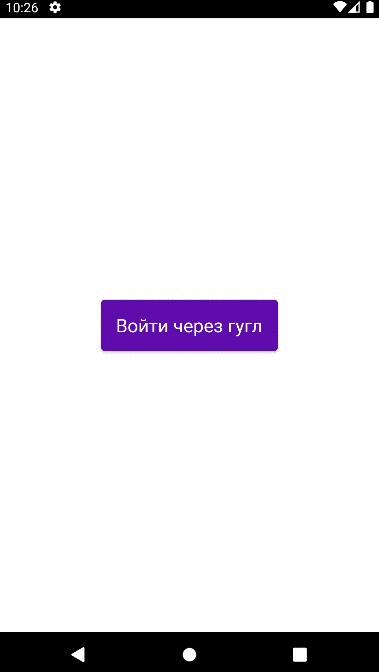
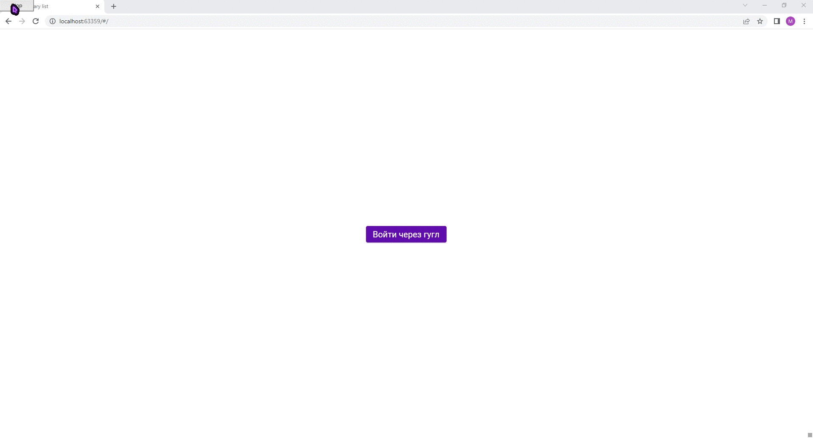

# Firebase

## Демо

### На мобильном устройстве (узкий экран)

### В браузере (широкое окно)

## Нужно сделать/переделать:
* фильтрация на сервере
* увеличить шрифт при широком экране
* в вебе при обновлении приходится снова заходить в аккаунт, исправить
* метод для поиска "вещи" по id
* применить модели для покупок и вещей
* исправить ошибку при отсутствии фото пользователя
* UI экрана авторизации
* анимации
* редактирование названия покупки
* при увеличении ширины на экране деталей показывается тот же экран, исправить
* (позже) возможность добавлять других пользователей к спискам -> stream ??
